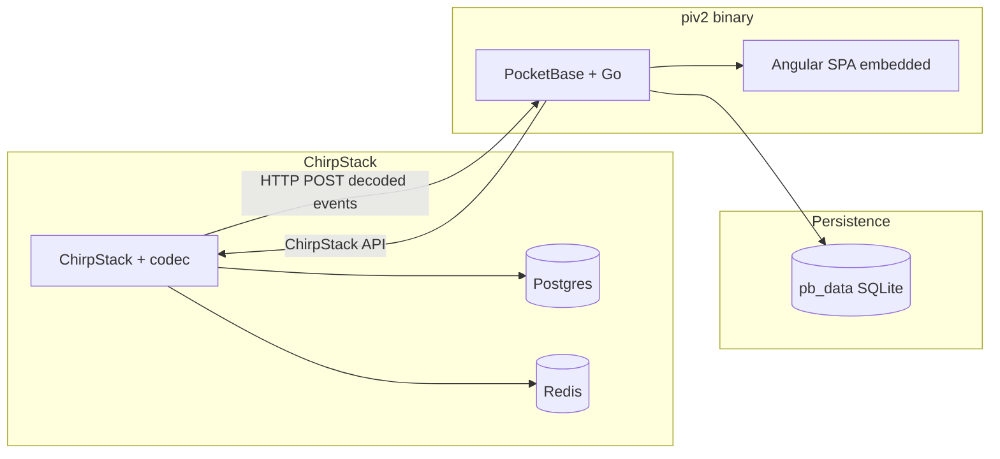

# piv2: ChirpStack + PocketBase + Angular — Phased plan

## Principles

- **No MQTT.** Mosquitto eliminated. ChirpStack uses **HTTP integration only**; decodes via device-profile codec and POSTs decoded events to our backend.
- **Single binary.** PocketBase + Go extension serves the Angular app via embedded static files and SPA fallback (per PocketBase docs).
- **End goal.** Working prototype with **all features** from the current Node-RED dashboard migrated (devices, telemetry, history, controls, rules, OTA, gateway status, error display).

---

## Target architecture

---

## Embed and serve Angular (official PocketBase approach)

Per [PocketBase – Extend with Go (Overview)](https://pocketbase.io/docs/go-overview) and [Routing](https://pocketbase.io/docs/go-routing):

1. **Prebuilt executable:** If you use the standard `pb_public` directory, PocketBase serves it at `/` when the directory exists. No embed needed.
2. **Custom Go app (our case):** Register static serving in `OnServe()`. Use `apis.Static(fsys, indexFallback)`:
  - **fsys:** A `fs.FS` (e.g. `os.DirFS("./pb_public")` for development, or **embedded** via `//go:embed` for single binary).
  - **indexFallback:** Set to `**true`** for SPA: when a requested file is missing, the handler serves the root `index.html` so client-side routing works.

**Single-binary embed pattern:**

- Build Angular (e.g. `ng build`) to a fixed output dir (e.g. `frontend/dist/farmmon/browser/`).
- In Go:
  - `//go:embed all:frontend/dist/farmmon/browser`
  - `embedFS` → use `fs.Sub(embedFS, "frontend/dist/farmmon/browser")` to get the root of the built app.
  - In `OnServe()`: register **after** API routes so `/api/` and `/_/` are not overridden:
    - `se.Router.GET("/{path...}", apis.Static(subFS, true))` to serve the SPA with fallback to `index.html`.

**Route order:** Register ChirpStack webhook and any custom API routes first; then the catch-all static route. Avoid serving the SPA under a path that clashes with PocketBase’s `/api/` and `/_/`.

**References:** [Go Overview – serves static files from public dir](https://pocketbase.io/docs/go-overview), [Go Routing](https://pocketbase.io/docs/go-routing); `apis.Static(fsys, indexFallback)` with `indexFallback: true` for SPA.

---

## UI stack: Angular + DaisyUI and best practices

- **Angular:** Standalone components, signals for state where appropriate, `inject()` for DI, lazy-loaded feature modules. Follow [Angular style guide](https://angular.dev/best-practices) (single responsibility, smart/dumb components, reactive patterns).
- **Styling:** **DaisyUI** on top of **Tailwind CSS**. Use DaisyUI components (buttons, cards, modals, dropdowns, etc.) and themes for a consistent, accessible UI.
- **API:** Angular talks to PocketBase REST (`/api/collections/...`) and custom Go endpoints (e.g. downlink enqueue, OTA trigger). Keep request/response shapes aligned with [DATA_CONTRACT](pi/nodered/docs/DATA_CONTRACT.md) where it simplifies migration.

---

## Features to migrate (working prototype scope)

From [DATA_CONTRACT](pi/nodered/docs/DATA_CONTRACT.md) and current flows; all must work in the prototype:

| Feature              | Description                                                                                          |
| -------------------- | ---------------------------------------------------------------------------------------------------- |
| **Device list**      | getDevices → list devices (eui, name, type, lastSeen).                                               |
| **Device selection** | selectDevice(eui, range?) → load device config and context.                                          |
| **Device config**    | Fields, controls, schema, current state (from registration + telemetry).                             |
| **History**          | getHistory(eui, field, range?) → `{ eui, field, data: [{ ts, value }] }` for telemetry and rssi/snr. |
| **Controls**         | setControl(eui, control, state, duration?), clearOverride(eui, control).                             |
| **Rules**            | getRules(eui), saveRule(eui, ...rule), getEdgeRules(eui).                                            |
| **System commands**  | sendCommand(eui, fPort, command, value?) (e.g. set interval).                                        |
| **OTA**              | otaStart(eui, firmware), otaCancel(eui); progress and firmware history / error log.                  |
| **Gateway status**   | Show gateway online/offline (from ChirpStack API); critical banner when offline.                     |
| **Error display**    | Device error object (ec + 15 sub-keys per DATA_CONTRACT); device info bar / diagnostics.             |

---

## Phased implementation

### Phase 1 — Infra and uplink pipeline

**Goal:** ChirpStack sends decoded uplinks to PocketBase over HTTP; devices and telemetry are stored and queryable.

- **1.1** Create `piv2/` layout: docker-compose (ChirpStack + Postgres + Redis only; **no Mosquitto**). ChirpStack config: `enabled = ["http"]`, `[integration.http]` with `event_endpoint` → PocketBase URL, `json = true`.
- **1.2** PocketBase app (Go): `main.go` with `OnServe()`, single `POST /api/chirpstack` handler; read `event` query param; parse JSON into UplinkEvent (and other event types). For `event=up`: map deviceInfo, fPort, decoded object, rxInfo → PocketBase.
- **1.3** PocketBase schema: collections **devices**, **telemetry** (device_eui, data JSON, rssi, snr, ts). Bootstrap or migrations. Persist `pb_data` via volume for deployments.
- **1.4** Verify: device sends uplink → ChirpStack codec runs → HTTP POST to PocketBase → device + telemetry rows created.

**Exit criterion:** Uplinks end up in PocketBase; no MQTT.

---

### Phase 2 — Full schema and downlinks

**Goal:** All app data models in place; backend can enqueue downlinks via ChirpStack API.

- **2.1** Add collections: device_fields, device_controls, device_triggers, state_changes, commands, edge_rules, firmware_history, settings, viz_config, device_schemas (mirror [init-db.sql](pi/postgres/init-db.sql) semantics).
- **2.2** Extend ChirpStack webhook: handle registration (fPort 1) → devices + device_fields + device_controls + device_triggers; telemetry (fPort 2) → telemetry + device_controls current state; state change (fPort 3) → state_changes + device_controls; command ack (fPort 4), OTA progress (fPort 8), diagnostics (fPort 6) as needed. Join/ack/txack/status/log → device or audit updates.
- **2.3** ChirpStack API client in Go: enqueue downlink (device queue). Use gRPC or [chirpstack-rest-api](https://github.com/chirpstack/chirpstack-rest-api). Implement custom endpoints (or PocketBase hooks) for: setControl, sendCommand, otaStart (chunk scheduling), otaCancel.
- **2.4** Gateway status: periodic or on-demand call to ChirpStack API for gateway list/status; expose via PocketBase collection or custom endpoint for the UI.

**Exit criterion:** All uplink types persisted; downlinks (control, command, OTA) and gateway status available from backend.

---

### Phase 3 — Angular app (DaisyUI) and feature parity

**Goal:** Working prototype UI with all migrated features.

- **3.1** Angular project under `piv2/frontend/`: Tailwind + DaisyUI; standalone components; lazy-loaded modules (e.g. device list, device detail, OTA, settings). Build output: e.g. `frontend/dist/farmmon/browser/`.
- **3.2** Implement screens and flows:
  - Device list (getDevices) and device selector (selectDevice).
  - Device detail: config (fields, controls, schema), current state, history charts (getHistory for each field / rssi / snr).
  - Controls: setControl, clearOverride with feedback.
  - Rules: getRules, saveRule, getEdgeRules and sync to device.
  - System commands: sendCommand (e.g. set interval).
  - OTA: otaStart (upload firmware), otaCancel; progress and firmware history / error log.
  - Gateway status banner (from backend API).
  - Error display: device error object (ec + categories) in device info bar / diagnostics.
- **3.3** API layer: PocketBase REST for collections; custom Go endpoints for downlink enqueue, OTA, gateway status where needed. Keep payload shapes consistent with DATA_CONTRACT for history, device config, and OTA responses.
- **3.4** Embed and serve: `//go:embed` the Angular build; in `OnServe()` register `GET /{path...}` with `apis.Static(subFS, true)` after API routes. Confirm SPA routing and asset loading.

**Exit criterion:** Single binary runs; Angular app loads at `/`; all features above work against PocketBase + ChirpStack.

---

### Phase 4 — Polish and migration

**Goal:** Production-ready prototype; optional data migration from existing deployment.

- **4.1** Error handling, loading states, and validation in UI and API.
- **4.2** Optional: script to export existing farmmon Postgres data and import into PocketBase collections (or document “fresh start” for dev).
- **4.3** Documentation: runbook (env, volumes, ChirpStack application/device profile), backup/restore for `pb_data`.

**Exit criterion:** Deployable prototype; persistence across deployments; docs in place.

---

## PocketBase schema (reference)

| Collection           | Purpose                                                                                                             |
| -------------------- | ------------------------------------------------------------------------------------------------------------------- |
| devices              | device_eui, device_name, device_type, firmware_version, registration (JSON), first_seen, last_seen, is_active       |
| device_fields        | device_eui, field_key, display_name, data_type, unit, category, min/max, enum_values                                |
| device_controls      | device_eui, control_key, current_state, mode, manual_until, last_change_at, last_change_by                          |
| telemetry            | device_eui, data (JSON), rssi, snr, ts                                                                              |
| state_changes        | device_eui, control_key, old_state, new_state, reason, device_ts, ts                                                |
| commands             | device_eui, command_key, payload, initiated_by, status, sent_at, acked_at                                           |
| firmware_history     | device_eui, started_at, finished_at, outcome, firmware_version, total_chunks, chunks_received, error_message        |
| edge_rules           | device_eui, rule_id, field_idx, operator, threshold, control_idx, action_state, priority, cooldown_seconds, enabled |
| device_schemas       | device_eui, version, schema (JSON)                                                                                  |
| settings, viz_config | As in current DB                                                                                                    |

---

## Pros and cons (recap)

| Aspect          | Pros                                                                   | Cons                                                                        |
| --------------- | ---------------------------------------------------------------------- | --------------------------------------------------------------------------- |
| **Stack**       | No Mosquitto; single binary (PocketBase + Angular); one app to deploy. | Gateway status via ChirpStack API (polling/on-demand) instead of MQTT push. |
| **Decoding**    | ChirpStack codec only; backend is receive + map + persist.             | Codec changes stay in ChirpStack device profile.                            |
| **UI**          | Angular + DaisyUI: one framework, clear structure, good DX.            | Full rewrite of current Vue/UIBuilder dashboard.                            |
| **Persistence** | SQLite in `pb_data`, one volume; backup/restore is straightforward.    | High telemetry write rate may need indexing/retention policy.               |

---

## References

- [PocketBase – Introduction](https://pocketbase.io/docs/) (default routes; `pb_public` for prebuilt).
- [PocketBase – Extend with Go (Overview)](https://pocketbase.io/docs/go-overview) (OnServe, Static from dir/embed).
- [PocketBase – Go Routing](https://pocketbase.io/docs/go-routing) (GET/POST, path params, BindBody, JSON).
- [ChirpStack HTTP integration](https://www.chirpstack.io/docs/chirpstack/integrations/http.html).
- [ChirpStack Event types](https://www.chirpstack.io/docs/chirpstack/integrations/events.html).
- [DATA_CONTRACT](pi/nodered/docs/DATA_CONTRACT.md); [codec.js](pi/chirpstack/codec.js).

