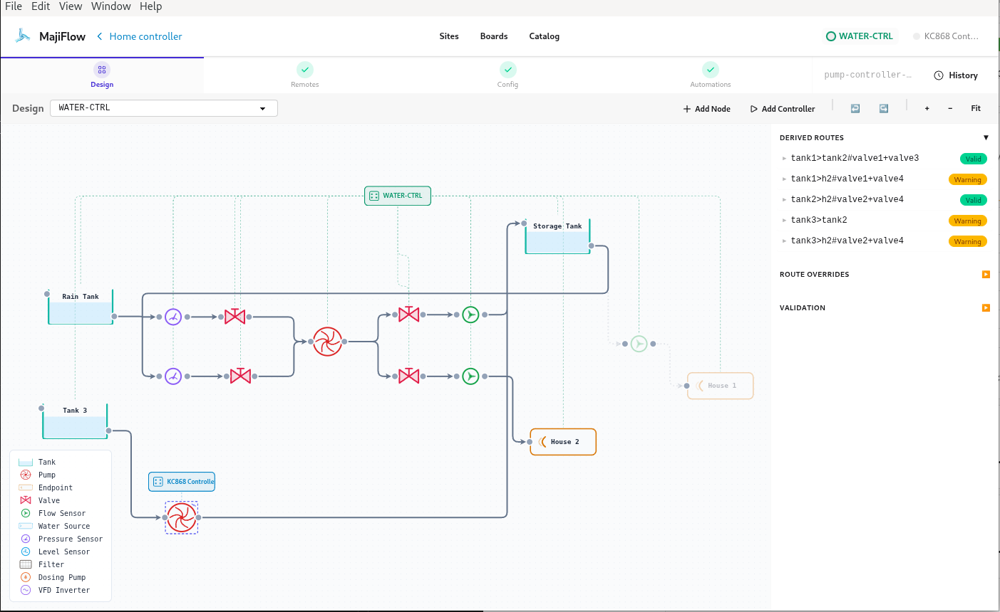
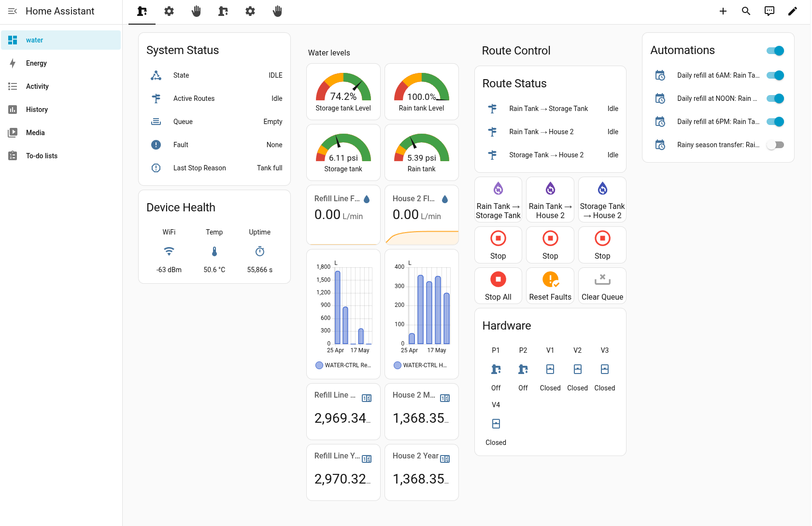
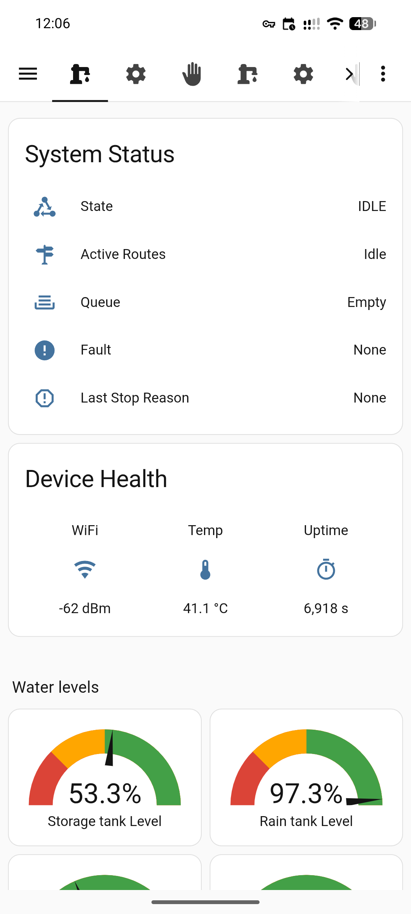

<p align="center">
  
</p>

# MajiFlow

**Design tool and firmware generator for water monitoring and automation.**

MajiFlow targets any installation where water is a critical resource, like irrigation farms, hotels, greenhouses, borehole sites; and reliable metrics and automation are required. You draw your tanks, pumps, valves, and sensors on a screen. MajiFlow checks that the design will work, generates the controller firmware, builds you a monitoring dashboard, and writes installation documentation that a qualified plumber and electrician (for pump automation) can follow.

The project was born in a dry-region farming context where irrigation is the only path to food security, but the same stack works wherever water must be moved, metered, and monitored at scale.

## Features

- **Metrics and monitoring** — tank levels, flow rates, valve states, and alarms in one dashboard, accessible from anywhere
- **Visual designer** — map tanks, pumps, valves, flow sensors, and pipe routes
- **Automatic validation** — pin conflicts, wrong sensor pairings, and routing errors caught before you buy hardware
- **Firmware** — complete, flashable ESPHome code for each controller, ready to install
- **Installation docs** — step-by-step instructions and wiring diagrams that a plumber can follow. The low-voltage pump control wiring must be done by an electrician.
- **Drift detection** — know when a controller in the field has fallen out of sync with your latest design
- **Automation** — schedule pumps, set fill rules, and trigger actions based on sensor readings
- **Hardware estimator** — a quick quote page to budget your build without opening the designer

## Result

A working system gives you one dashboard with three things:

- **Metrics** — e.g. Field A used 10,300 L this week; the main tank has been at 85% for two days
- **Remote control** — turn pumps and valves on or off from your phone, wherever you are
- **Automation** — e.g. fill the reservoir at 6 AM on Mondays and Thursdays, or whenever the tank drops below 30%

## Screenshots

**Visual designer** — draw tanks, pumps, valves, and sensors on a screen. MajiFlow validates the design before you spend money.

<p align="center">
  
</p>

**Monitoring dashboard** — tank levels, flow rates, route control, and automations in one place.

<p align="center">
  
</p>

<p align="center">
  
</p>
<p align="center"><em>Access your dashboard from anywhere — desktop or mobile.</em></p>

## Two parts, one system

MajiFlow bridges the design on your screen and the hardware in the field.

**The software** is the desktop design app and the monitoring dashboard. You draw your system, validate it, and generate controller firmware from your laptop.

**The hardware** is off-the-shelf ESP32 controllers, sensors, pumps, and valves that you source locally or through the hardware estimator. MajiFlow produces the firmware that makes every part work together.

The two parts meet in the field. Firmware generated by the app gets flashed onto each controller. Those controllers physically switch your pumps and valves, read your sensors, and report back to the dashboard over your network. When you change the design and re-deploy, MajiFlow checks whether the running controllers match the latest version.

Because the hardware is standard and the firmware is generated from your design, you own the full stack. Replace any part independently if you'd like. 

**The entire stack runs on premises** meaning no cloud subscriptions or recurring costs.

## How it works

1. **Design** — draw the system in the app
2. **Validate** — MajiFlow checks pins, power budget, and route logic
3. **Generate** — firmware, dashboard YAML, and installation docs are produced automatically
4. **Install** — plumber handles pipes and mounting; electrician handles the pump control circuit
5. **Monitor** — track and control everything from the dashboard. Automation is there when you want it, but visibility comes first.

## Architecture

Three layers, each replaceable independently:

1. **Board definitions** (`defaults/boards/`) — what the hardware can do (pins, buses, peripherals)
2. **System manifest** — what you want (tanks, pumps, valves, routes, timing)
3. **Generated output** — firmware + dashboards + docs, driven by layers 1 + 2

Adding a new board means writing one YAML file and an optional SVG pinout. The code generator checks capabilities, not board names.

## Quick start

```bash
npm install
npm run dev          # Angular dev server + Electron
```

Generate and flash firmware from the desktop app, or run tests headless:

```bash
npm test             # 67 integration assertions
npm run test:limits  # Scaling ceiling discovery
```

## Project structure

```
src/             # Angular frontend (renderer process)
electron/        # Electron main process, IPC handlers, codegen engine
electron/lib/    # Generators, validators, topology engine
packages/core/   # Shared types, topology logic, and quotation engine
test/            # Integration and scaling tests
defaults/        # Bundled board definitions and example configs
docs/            # Documentation and development journal
homepage/           # Static site (homepage + quick quote) for GitHub Pages
```

## Desktop app

Angular + Electron + DaisyUI.

- Create, duplicate, rename, and delete sites
- Interactive board SVG with live pin overlays and GPIO budget bar
- Tabbed editor for devices, tanks, valves, flow sensors, routes, timing, and topology
- One-click generate, compile, and flash per controller
- Backup to Google Drive

## Tests

```bash
npm test            # Integration assertions
npm run test:db     # Database layer
npm run test:limits # Scaling and boundary discovery
```

## License

AGPL-3.0-or-later
