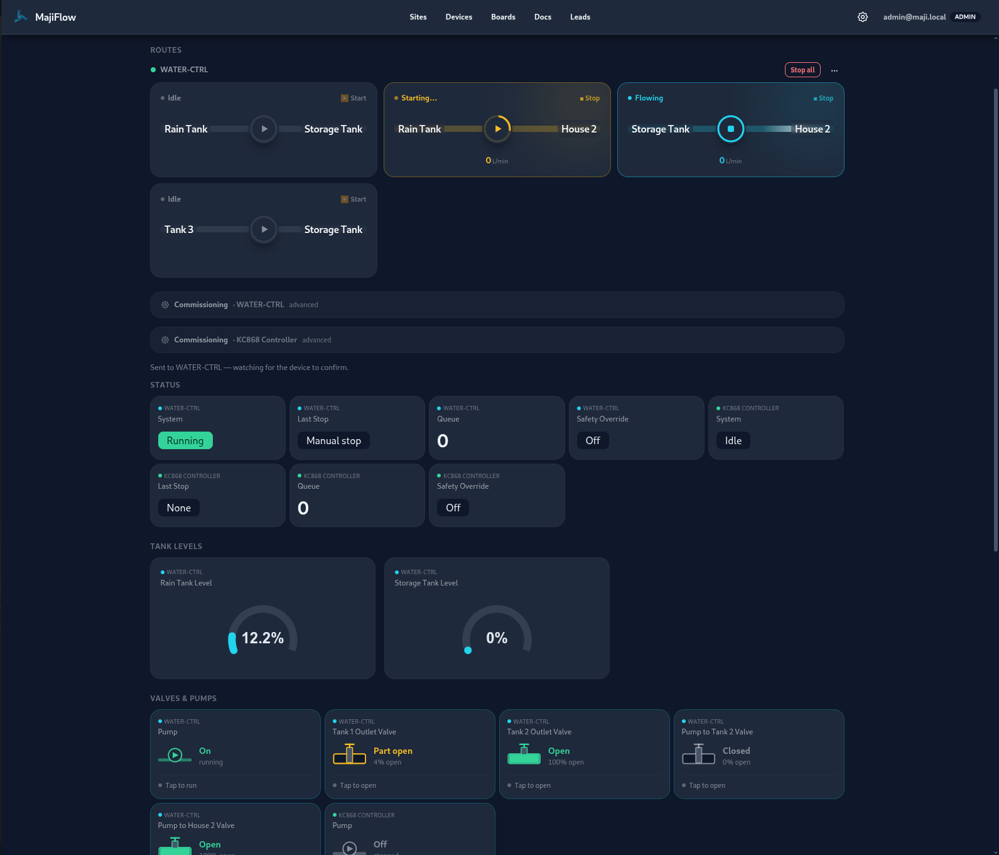
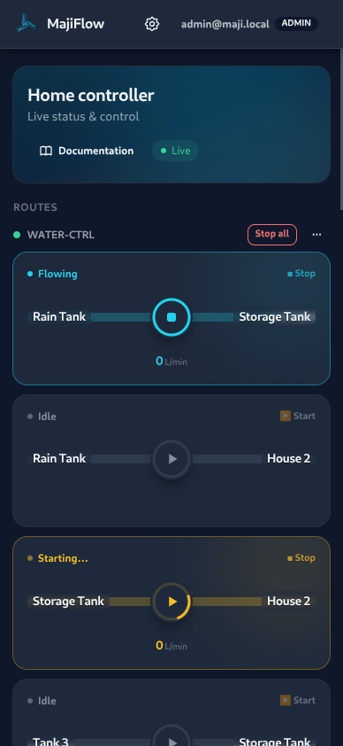
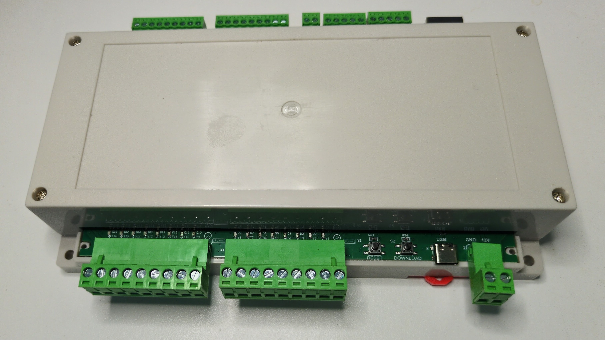

<p align="center">
  
</p>

# MajiFlow

**Design tool and firmware generator for water monitoring and automation.**

MajiFlow targets any installation where water is a critical resource — irrigation farms, hotels, greenhouses, borehole sites — and reliable metrics and automation matter. You draw your tanks, pumps, valves, and sensors in the browser. MajiFlow checks that the design will work, generates the controller firmware, builds you a live dashboard, and writes installation documentation that a qualified plumber and electrician (for pump automation) can follow.

The project was born in a dry-region farming context where irrigation is the only path to food security, but the same stack works wherever water must be moved, metered, and monitored at scale.

## Features

- **Metrics and monitoring** — tank levels, flow rates, valve states, and alarms in one dashboard, reachable from anywhere
- **Visual designer** — map tanks, pumps, valves, flow sensors, and pipe routes in the browser
- **Automatic validation** — pin conflicts, wrong sensor pairings, and routing errors caught before you buy hardware
- **Firmware** — complete, flashable ESPHome code for each controller, ready to install
- **Installation docs** — step-by-step instructions and wiring diagrams a plumber can follow; the low-voltage pump control wiring is for an electrician
- **Remote control** — start and stop pumps and valves, or hold a manual override, from your phone
- **Drift detection** — know when a controller in the field has fallen out of sync with your latest design
- **Automation** — schedule pumps, set fill rules, and trigger actions based on sensor readings
- **Hardware estimator** — a quick quote page to budget your build without opening the designer

## Result

A working system gives you one dashboard with three things:

- **Metrics** — e.g. Field A used 10,300 L this week; the main tank has been at 85% for two days
- **Remote control** — turn pumps and valves on or off from your phone, wherever you are
- **Automation** — e.g. fill the reservoir at 6 AM on Mondays and Thursdays, or whenever the tank drops below 30%

## Screenshots

**Visual designer** — draw tanks, pumps, valves, and sensors on a screen. MajiFlow validates the design before you spend money.

<p align="center">
  
</p>

**Monitoring dashboard** — tank levels, flow rates, route control, and manual control in one place.

<p align="center">
  
</p>

<p align="center">
  
</p>
<p align="center"><em>Access your dashboard from anywhere — desktop or mobile.</em></p>

**The controller** — off-the-shelf hardware that reads your sensors and switches your pumps and valves.

<p align="center">
  
</p>

## Two parts, one system

MajiFlow bridges the design on your screen and the hardware in the field.

**The software** is the web app: the visual designer and the live dashboard, both in the browser. You draw your system, validate it, and generate controller firmware from any laptop — nothing to install.

**The hardware** is off-the-shelf ESP32 controllers (such as the KC868 family), sensors, pumps, and valves that you source locally or through the hardware estimator. MajiFlow produces the firmware that makes every part work together.

The two parts meet in the field. Firmware generated by the app is flashed onto each controller. Those controllers physically switch your pumps and valves, read your sensors, run their own schedules and safety checks, and report back to the dashboard. Each controller stays autonomous: it keeps running its routine whether the network — or the internet — is up or not.

Because the hardware is standard and the firmware is generated from your design, you own the full stack and can replace any part independently.

## Two ways to run it

Same app, same dashboard. The choice is who runs the backend:

- **Managed** — we host the server online and keep it up (the `cloud` build). Lowest upfront cost; you just sign in to watch and control. Each controller runs as an independent island.
- **On-prem, own it** — an on-site hub (the `edge` build) runs your whole site by itself, with battery and solar carrying it through power cuts and no dependence on us. Controllers can share sensors and coordinate across the site, and you reach it over your own private connection, so your data never passes through us.

Either way, you only need the internet to check in while you are away — the controllers do not.

## How it works

1. **Design** — draw the system in the browser
2. **Validate** — MajiFlow checks pins, power budget, and route logic
3. **Generate** — firmware, the live dashboard, and installation docs are produced automatically
4. **Install** — plumber handles pipes and mounting; electrician handles the pump control circuit
5. **Monitor** — track and control everything from the dashboard. Automation is there when you want it, but visibility comes first.

## Architecture

Design-time, three layers, each replaceable independently:

1. **Board definitions** (`defaults/boards/`) — what the hardware can do (pins, buses, peripherals)
2. **System manifest** — what you want (tanks, pumps, valves, routes, timing)
3. **Generated output** — firmware + dashboard + docs, driven by layers 1 + 2

Adding a new board means writing one YAML file and an optional SVG pinout. The code generator checks capabilities, not board names.

At runtime, each controller talks to the server over MQTT — telemetry up, commands down — and is otherwise self-contained. In on-prem mode, controllers also coordinate directly with each other over UDP, so a shared pump or water source works across the whole site. Commands carry a short lease, so a manual hold releases on its own if your connection drops.

## Quick start

```bash
npm install                  # frontend deps
cd maji-server && make dev   # Go server hosts the SPA (rebuilds on change) at :8090
```

Open `http://127.0.0.1:8090` and log in with the dev admin (`admin@maji.local` / `majiadmin123`).
Generate and flash firmware from the app, or run tests headless (see below).

The server ships in two builds: `make build-cloud` (managed, multi-tenant) and `make build-edge` (single-tenant, on-prem). To deploy, see [deploy/README.md](deploy/README.md).

## Project structure

```
src/app/         # Angular web app (designer, dashboard, admin)
src/lib/         # @core — shared types, topology → manifest → codegen, validators
maji-server/     # Go server: PocketBase (DB + auth + SPA host) + embedded MQTT broker; cloud + edge builds
test/            # Integration and scaling tests
defaults/        # Bundled board definitions and example configs
public/          # Static assets served at the site root (brand, marketing)
docs/            # Documentation and development journal
deploy/          # Dockerfile entrypoint + deployment guide
```

## The app

Angular + DaisyUI, served by the Go backend (one origin). Firmware is generated in the browser.

- Create, duplicate, rename, and delete sites
- Interactive board SVG with live pin overlays and GPIO budget bar
- Tabbed editor for devices, tanks, valves, flow sensors, routes, timing, and topology
- One-click generate per controller; compile and flash from the downloaded bundle
- Live monitoring dashboard with remote control and automation

## Tests

```bash
npm test              # codegen integration assertions
npm run test:limits   # scaling and boundary discovery
npm run test:topology # topology → manifest
cd maji-server && make test   # Go server + database layer (race)
```

## License

AGPL-3.0-or-later
