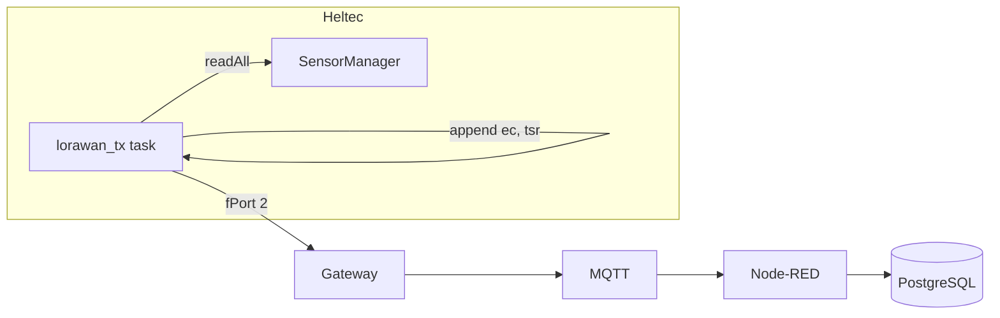

# Architecture

## Overview

Farmon is a LoRaWAN-based farm monitoring system: Heltec sensor nodes send telemetry to a Raspberry Pi stack (ChirpStack, Node-RED, PostgreSQL).

```
┌─────────────────┐      LoRaWAN       ┌─────────────────┐
│  Heltec Sensors │ ──────────────────►│  SX1302 Gateway │
└─────────────────┘                    └────────┬────────┘
                                                │
                                       ┌────────▼────────┐
                                       │  Raspberry Pi   │
                                       │  ChirpStack     │
                                       │  Node-RED       │
                                       │  PostgreSQL     │
                                       └─────────────────┘
```

**Firmware (three-layer composition):** [FIRMWARE_ARCHITECTURE.md](FIRMWARE_ARCHITECTURE.md) — lib, integrations, devices; sensor-defined config; control drivers.

## Data Flow (Pull Model)

TX task pulls fresh data from SensorManager and system state; no queue.



- **SensorManager.readAll()**: Calls each sensor’s `read(readings)`; appends system fields (ec, tsr).
- **LoRaWANTransmitter**: Formats key:value payload, validates size, sends on fPort 2.
- **Edge rules**: After telemetry, rules engine evaluates; triggers IControlDriver.setState() per control.

## Scheduler Tasks

| Task | Interval | Role |
|------|----------|------|
| battery | 1s | Update battery HAL |
| persistence | 60s | Save water flow total (if used) |
| lorawan_tx | txIntervalMs | readAll + system fields → transmit; then evaluate rules |
| state_tx | 5s | Send pending control state change (fPort 3) |
| display | 200ms | uiService->tick() |
| lorawan | 50ms | LoRaWAN state machine |
| lorawan_join | 100ms | Set join flag (main loop performs join) |

## Interrupt Safety (Water Flow)

- IRAM_ATTR pulse handler increments volatile `_pulseCount`.
- `read()`: noInterrupts(); read and reset `_pulseCount`; interrupts(); accumulate to `_totalPulses`.
- Persistence task saves `_totalPulses` periodically.
