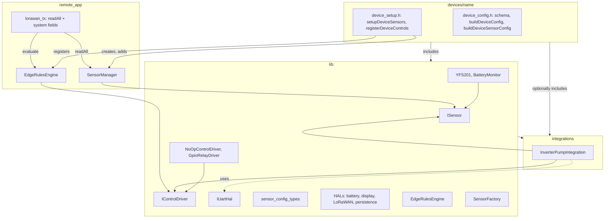
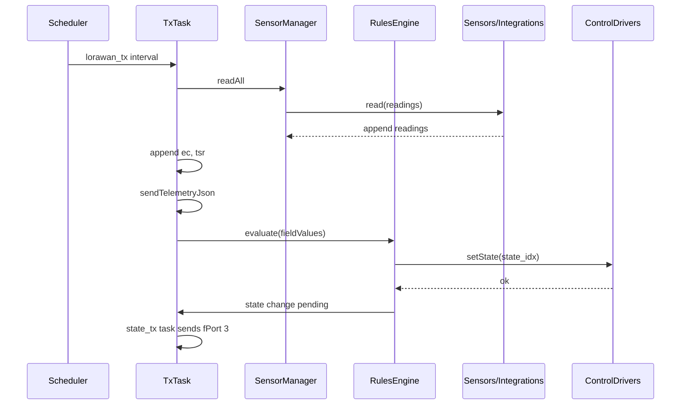

# Firmware Architecture

Three-layer composition: **lib** (building blocks), **integrations** (protocol/device modules), **devices** (wiring). No registry; device includes and instantiates what it uses.

## Layer Diagram

## Data and Control Flow

## Layer Responsibilities

| Layer | Location | Contents |
|-------|----------|----------|
| **lib** | `heltec/lib/` | ISensor, IControlDriver, IUartHal; sensor_config_types; HALs; YFS201, BatteryMonitor; NoOpControlDriver, GpioRelayDriver; EdgeRulesEngine; SensorFactory. No device or protocol-specific logic. |
| **integrations** | `heltec/integrations/` | One header per protocol/device (e.g. inverter_pump.h). Config struct, ISensor + IControlDriver, depends only on lib. Reusable across devices. |
| **devices** | `heltec/devices/<name>/` | device_config.h: schema, buildDeviceConfig, buildDeviceSensorConfig. device_setup.h: setupDeviceSensors (create from config, add to SensorManager), registerDeviceControls (create drivers, register with engine). |

## Sensor Config

- **Sensor-defined params**: Each sensor type in lib exposes a config struct (e.g. `SensorConfig::YFS201WaterFlow`: pin, enabled, persistence_namespace). `RemoteSensorConfig` aggregates them.
- **Device supplies values**: `buildDeviceSensorConfig()` fills structs; `setupDeviceSensors` uses SensorFactory with those configs and adds to SensorManager. Sensor order in setup matches schema field order (pd, tv, bp) for rule evaluation.

## Control Drivers

- **IControlDriver**: `bool setState(uint8_t state_idx)`. EdgeRulesEngine holds either a function pointer or driver pointer per control index.
- **Lib drivers**: NoOpControlDriver (log only), GpioRelayDriver (pin, begin/setState).
- **Integration drivers**: e.g. InverterPumpIntegration implements both ISensor and IControlDriver.
- **Device**: In registerDeviceControls, instantiates drivers (static/file-static), calls engine.registerControl(idx, &driver).

## Build

- `./heltec.sh build <device>` generates `device_config_include.h` with `#include "devices/<device>/device_config.h"` and `#include "devices/<device>/device_setup.h"`.
- remote_app.cpp includes lib/sensor/edge_rules, then device_config_include.h. Setup functions are in scope; no duplicate includes.
